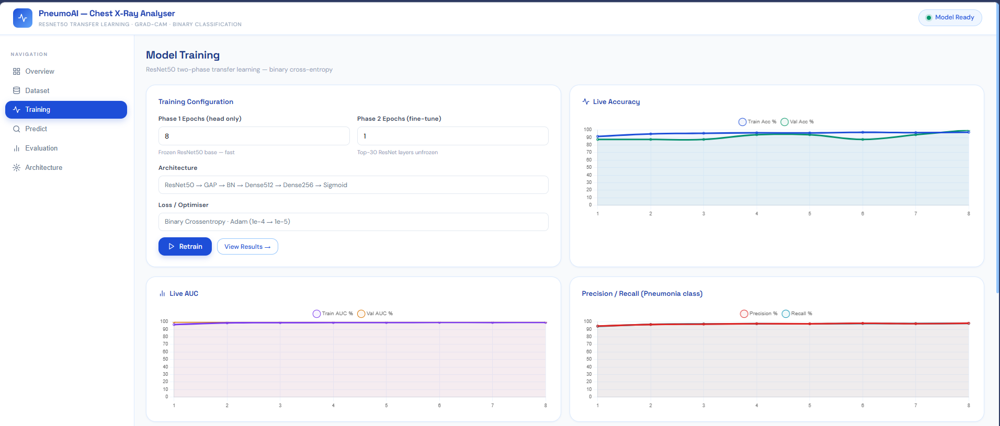
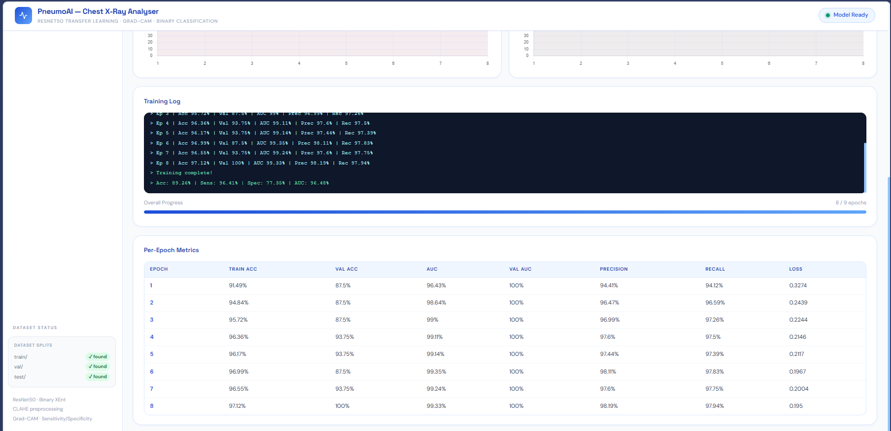
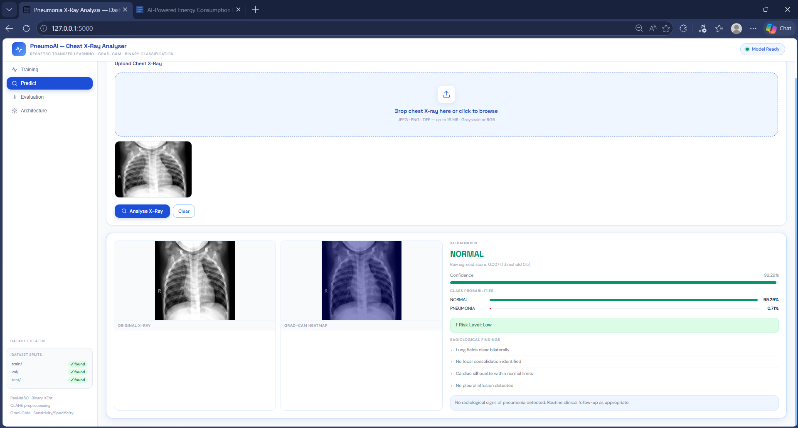
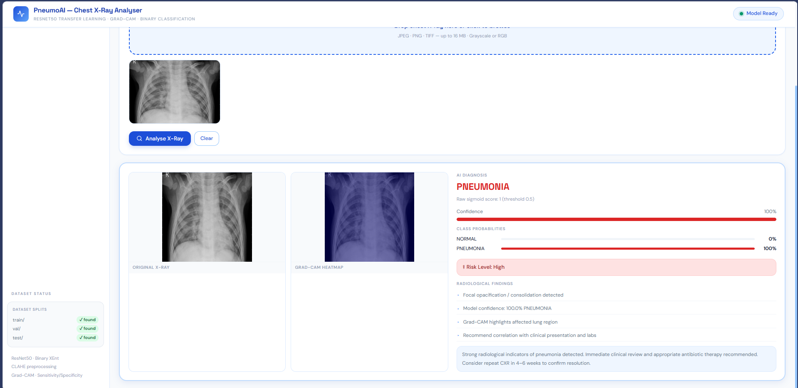

# PneumoAI: Chest X-Ray Pneumonia Detection

PneumoAI is a Flask-based deep learning project for binary chest X-ray classification: `NORMAL` vs `PNEUMONIA`. It combines a ResNet50 transfer learning pipeline, real-time training updates through Socket.IO, evaluation visualizations, and a browser dashboard for image upload and prediction.

This project is designed for academic demonstration and portfolio use. It is not a clinical diagnostic system.

## Features

- Binary classification for chest X-rays: `NORMAL` or `PNEUMONIA`
- ResNet50 transfer learning with two-phase training
- Live training dashboard with epoch-wise accuracy, AUC, precision, and recall
- Flask + Socket.IO backend for real-time updates
- Prediction page with confidence scores and Grad-CAM output image generation
- Evaluation outputs including confusion matrix, ROC curve, and training curves
- CLI mode for training, prediction, and evaluation without opening the browser

## Tech Stack

- Python 3.9+
- TensorFlow / Keras 2.15
- Flask 3.0
- Flask-SocketIO
- OpenCV
- scikit-learn
- Matplotlib / Seaborn
- Chart.js

## Project Structure

```text
AI-Medical-Image-Analysis/
├── app.py
├── main.py
├── requirements.txt
├── README.md
├── data/
│   ├── raw/
│   │   ├── train/
│   │   ├── val/
│   │   └── test/
│   └── uploads/
├── models/
│   └── saved/
│       ├── class_names.json
│       └── pneumonia_resnet50.h5
├── outputs/
│   ├── classification_report.json
│   ├── confusion_matrix.png
│   ├── eval_metrics.json
│   ├── roc_curves.png
│   ├── training_curves.png
│   ├── training_history.json
│   └── predictions/
├── src/
│   ├── evaluate.py
│   ├── model.py
│   ├── predictor.py
│   ├── preprocessing.py
│   └── trainer.py
├── static/
├── templates/
│   └── index.html
└── docs/
```

## Model Pipeline

```text
Chest X-Ray Image
   -> resize to 224 x 224
   -> RGB conversion
   -> ResNet50 backbone
   -> GlobalAveragePooling
   -> BatchNormalization
   -> Dense(512) + Dropout
   -> Dense(256) + Dropout
   -> Sigmoid output
   -> NORMAL or PNEUMONIA
```

## Dataset

The app expects the dataset in this layout:

```text
data/raw/
├── train/
│   ├── NORMAL/
│   └── PNEUMONIA/
├── val/
│   ├── NORMAL/
│   └── PNEUMONIA/
└── test/
    ├── NORMAL/
    └── PNEUMONIA/
```

Current dataset split detected in the project:

| Split | NORMAL | PNEUMONIA | Total |
|---|---:|---:|---:|
| Train | 1341 | 3875 | 5216 |
| Val | 8 | 8 | 16 |
| Test | 234 | 390 | 624 |

## Installation

```powershell
git clone <your-repo-url>
cd "AI-Medical-Image-Analysis"
python -m venv venv
.\venv\Scripts\activate
pip install -r requirements.txt
```

## Run the Web App

```powershell
cd "C:\Users\91953\Desktop\ai diploma projects\AI-Medical-Image-Analysis (1)"
.\venv\Scripts\python.exe app.py
```

Open the dashboard at:

```text
http://127.0.0.1:5000
```

## Run from CLI

Train the model:

```powershell
.\venv\Scripts\python.exe main.py --mode train --epochs1 8 --epochs2 1
```

Quick smoke training:

```powershell
.\venv\Scripts\python.exe main.py --mode train --epochs1 1 --epochs2 0
```

Predict a single image:

```powershell
.\venv\Scripts\python.exe main.py --mode predict --image "data\raw\test\PNEUMONIA\person10_virus_35.jpeg"
```

Evaluate the saved model:

```powershell
.\venv\Scripts\python.exe main.py --mode evaluate
```

## Latest Evaluation Results

These values are taken from `outputs/eval_metrics.json` after training:

| Metric | Value |
|---|---:|
| Accuracy | 89.26% |
| Macro F1 | 88.10% |
| Weighted Recall | 89.26% |
| Sensitivity | 96.41% |
| Specificity | 77.35% |
| ROC-AUC | 96.48% |

Per-class F1:

| Class | F1 Score |
|---|---:|
| NORMAL | 84.38% |
| PNEUMONIA | 91.82% |

## Training Smoke Test Output

Example result from the recent 1-epoch smoke training run:

```text
652/652 [==============================] - 550s 820ms/step - loss: 0.3128 - accuracy: 0.9243 - auc: 0.9684 - precision: 0.9443 - recall: 0.9543 - val_loss: 0.3925 - val_accuracy: 0.8125 - val_auc: 1.0000 - val_precision: 0.7273 - val_recall: 1.0000 - lr: 1.0000e-04

== Evaluation Results ==
{
  "accuracy": 88.94,
  "macro_f1": 87.72,
  "weighted_recall": 88.94,
  "per_class": {
    "NORMAL": 83.84,
    "PNEUMONIA": 91.6
  },
  "sensitivity": 96.41,
  "specificity": 76.5,
  "roc_auc": 95.83
}
```

## Screenshots

Add your screenshots to `docs/screenshots/` and keep the names below for automatic display in the README.

### Training Dashboard




### Pneumonia Prediction Result




### Evaluation Plots


## Generated Output Files

After training and prediction, the project generates:

- `outputs/training_history.json`
- `outputs/eval_metrics.json`
- `outputs/classification_report.json`
- `outputs/confusion_matrix.png`
- `outputs/roc_curves.png`
- `outputs/training_curves.png`
- `outputs/predictions/*_report.json`
- `outputs/predictions/*_gradcam.png`

## Notes

- The current model is saved as `models/saved/pneumonia_resnet50.h5`
- Keras shows a warning that `.h5` is a legacy save format; `.keras` is the modern format
- The validation set is very small, so single-image prediction behavior may vary even when overall metrics look good
- Grad-CAM output is generated, but that path may need more refinement for fully robust explanation behavior on every loaded model state

## Disclaimer

This project is for educational and demonstration purposes only. It must not be used for real medical diagnosis, treatment decisions, or patient care.
